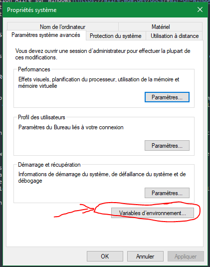
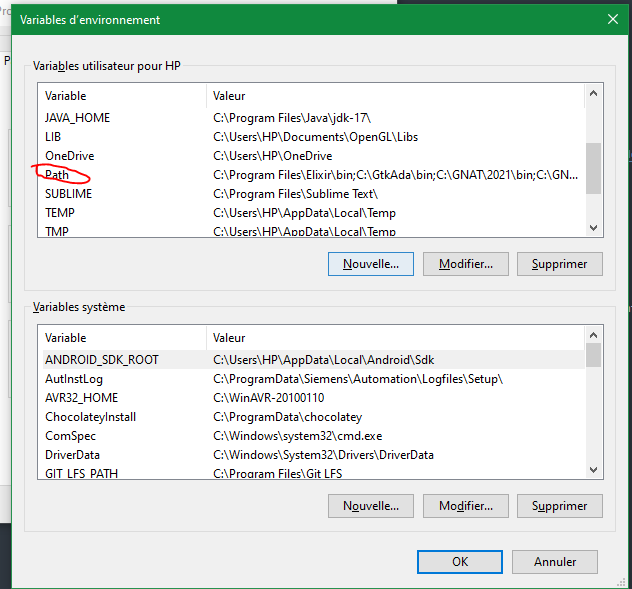
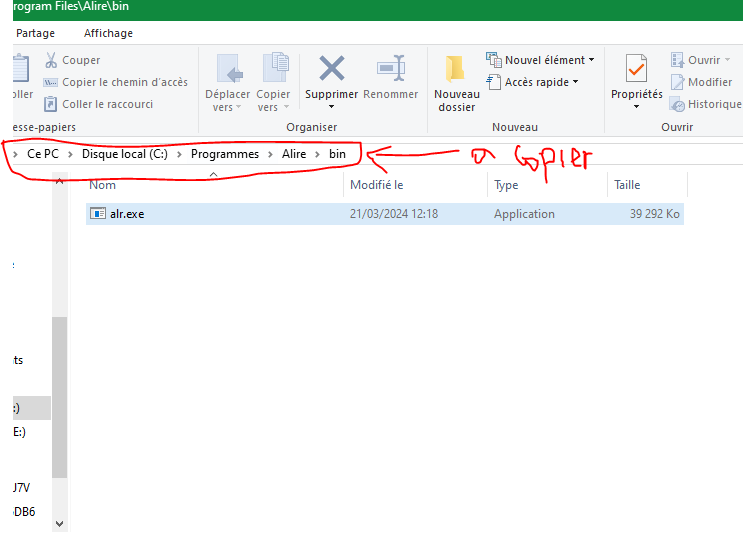
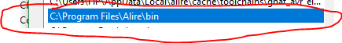

# INSTALLATION ENVIRONNEMENT DE TRAVAIL

Le développement logiciel pour les systèmes embarqués en Ada nécessite l'installation d'une pile logicielle.

## EDITEUR DE CODE

Un éditeur de code est l’endroit où les programmeurs passent la plus grande partie de leur temps.
Afin de réaliser les séquences de Tds et Tps, Visual code est l'éditeur choisi. VS Code prend en charge presque 
tous les principaux langages de programmation. Plusieurs sont livrés dans la boîte, comme JavaScript, HTML ...  
mais des extensions pour d'autres peuvent être trouvées sur VS Code Marketplace

## GESTIONNAIRE DE PACKAGES

Alire est un gestionnaire de packages basé sur les sources pour les langages de programmation Ada et SPARK.

C'est un moyen pour les développeurs de s'appuyer facilement sur des projets (bibliothèques ou programmes) partagés par la communauté, 
mais aussi de partager facilement leurs projets pour que d'autres puissent s'en servir.

Dans le vocabulaire Alire, les sources de projets/bibliothèques/programmes sont fournies par ce qu'on appelle une crate. 
Une crate peut dépendre de crates, et d'autres crates peuvent en dépendre aussi.

L'interface principale de l'écosystème Alire est un outil de ligne de commande appelé **alr**.

### ALIRE : TELECHARGEMENT & INSTALLATION

La procédure d'installation peut différée que vous soyez sur une machine avec un système d'exploitation Windows, Linux ou macOS.
Veuillez suivre la procédure vous concernant :

- [Installation Alire sur Windows](https://alire.ada.dev/docs/#alr-on-windows)
- [Installation Alite sur macOS](https://alire.ada.dev/docs/#alr-on-macos)
- [Installation Alire sur Linux](https://alire.ada.dev/docs/#alr-on-linux)

### VISUAL STUDIO CODE : TELECHARGMENT & INSTALLATION

Si c'est pas n'est encore fait, veuillez installer VS code. L'installation de VS code est bien détaillée [ici](https://code.visualstudio.com/download).

### TELECHARGEMENT PROJETS DE TEST

Obtenir un projet exécutable déjà catalogué dans Alire est une solution simple pour vérifier si l'installation s'est déroulée sans soucis.
Nous allons donc démarrer avec le projet **hello** qui est une simple **Hello, world** application.

> IMPORTANT : Alire est un utilitaire disponible en ligne de commande. Il est donc essentiel que l'éxécutable soit présent dans les variables d'environnement de votre
système.

- Sur windows, il suffit de verifier que Alire est présent dans la variable PATH. Pour cela :

1. Cliquez sur menu démarrer
2. Saisir variable d'environnement

3. Rechercher la variable PATH et double-cliquez dessus

4. Double cliquez sur une nouvelle ligne (vide) pour ajouter le chemin vers l'exécutable d'alire. Exemple si Alire est installé sur C:/Programmes Files/Alire/bin, copier le chemin comme ceci 

5. Le resultat final doit etre ceci.

6. Cliquez sur ok et fermer.
